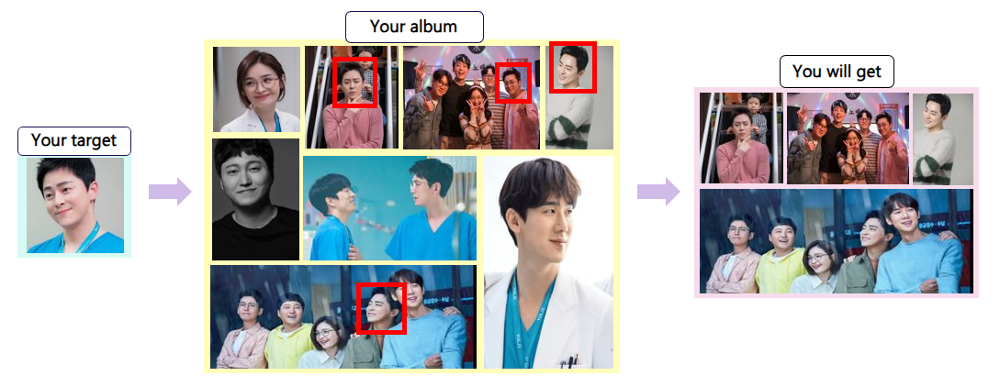
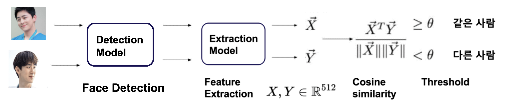
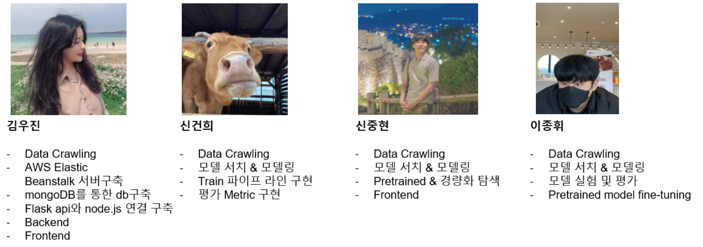
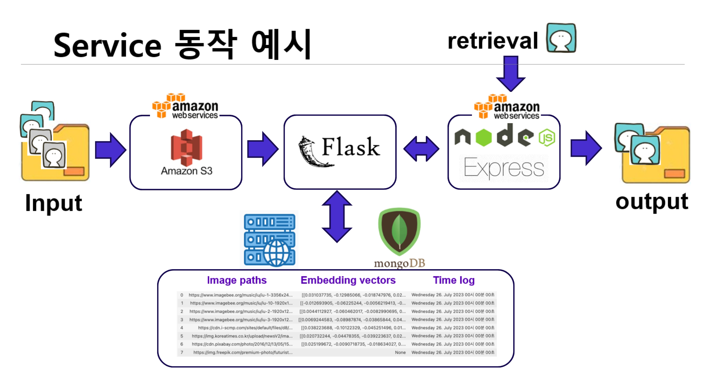

# 1. Memory sutdio



- "추억 사진관"은 사용자의 사진을 저장하고, 이를 관리하며, 특정 얼굴의 사진을 검색하는 기능을 제공하는 웹 기반 애플리케이션입니다.
- 특정 얼굴 사진을 Key로 사용하여 기존 사진 중 유사한 얼굴을 가진 사진을 찾을 수 있습니다.
<br/>

## Intro

<!---->

> memory studio는 크게 두가지 폴더로 구성되어있습니다. facerecognition은 ArcFace loss를 이용한 학습과 pretrained model을 불러와서 finetuning하는데 초점을 두었습니다.
>
> service에는 Node.js를 구성하는 finalproject 폴더와 Flask api를 구성하는 deploy_ml 폴더로 되어있습니다.

```
Face Recognition
├── Backbone
├── configs
└── docs
  ├── dataset.py
  ├── train.py
  ├── validation.py
  └── inference.py
  └── requirements.txt

Service
└── finalproject
  ├── node_modules
  ├── public
  ├── views
  ├── server.js
  └── package.json
  └── package-lock.json
└── deploy_ml
  ├── app.py
  └── requirements.txt
```

<br/>

## Web Page URL

### http://memory-studio.ap-northeast-2.elasticbeanstalk.com/

<br/>

## Member



|  이름  | github                          |
| :----: | ------------------------------- |
| 김우진 | https://github.com/w-jnn        |
| 신건희 | https://github.com/Rigel0718    |
| 신중현 | https://github.com/Blackeyes0u0 |
| 이종휘 | https://github.com/gndldl       |

<br/>

---

<br/>


# 2. Face Detection & Recognition

requirements.txt: 필요한 파이썬 라이브러리를 기술한 파일입니다.

<br/>

## 2.1 Pretrained Models & Performance

| 모델               | 데이터 세트 | accuracy | recall | F1 score | precision |
| ------------------ | ----------- | -------- | ------ | -------- | --------- |
| Arcface(Resnet 18) | MS1MV3      | 0.5485   | 0.6102 | 0.4579   | 0.3664    |
| Arcface(mobilenet) | Face emore  | 0.5321   | 0.5906 | 0.4410   | 0.3519    |
| Facenet(Inception) | VGGface2    | 0.8810   | 0.8382 | 0.8262   | 0.8096    |

<br/>

## 2.2 How to use

- clone

  ```
  git clone https://github.com/deepinsight/insightface.git
  ```
<br/>

## 2.3 Prepare Dataset ( For training)

download the refined dataset: (emore recommended)

- [emore dataset @ BaiduDrive](https://pan.baidu.com/s/1eXohwNBHbbKXh5KHyItVhQ), [emore dataset @ Dropbox](https://www.dropbox.com/s/wpx6tqjf0y5mf6r/faces_ms1m-refine-v2_112x112.zip?dl=0)
- More Dataset please refer to the [original post](https://github.com/deepinsight/insightface/wiki/Dataset-Zoo)

<br/>

## 2.4 dataset structure

```
- facedataset/
         name1/
             photo1.jpg
             photo2.jpg
             ...
         name2/
             photo1.jpg
             photo2.jpg
             ...
         .....
```
<br/>

## 2.5 Training:

```bash
python train.py configs/config
```
<br/>

---

<br/>

# 3. Service Architecture


> v100서버에 Flask를 RESTful API로 구현하여 모델을 서빙하고 배포했습니다.
>
> AWS Elastic Beanstalk를 사용하여 Node.js를 배포 했고, Flask api와 통신하고 있습니다.
>
> MongoDB Atlas를 사용하여 클라우드 환경의 MongoDB를 연결하였습니다.
>
> v100서버에 Flask를 통해 모델을 서빙하여 배포했습니다.


<br/><br/>




<br/>

---

<br/>

# 4. References

- This repo is mainly inspired by [deepinsight/insightface](https://github.com/deepinsight/insightface) and [FaceNet](https://github.com/davidsandberg/facenet)

