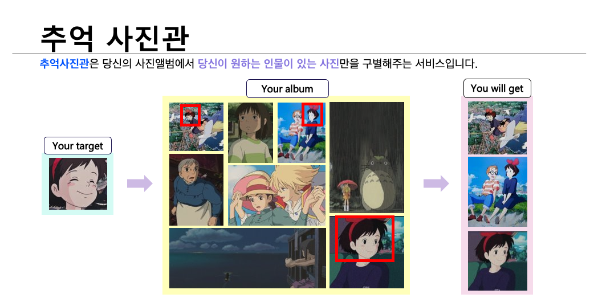
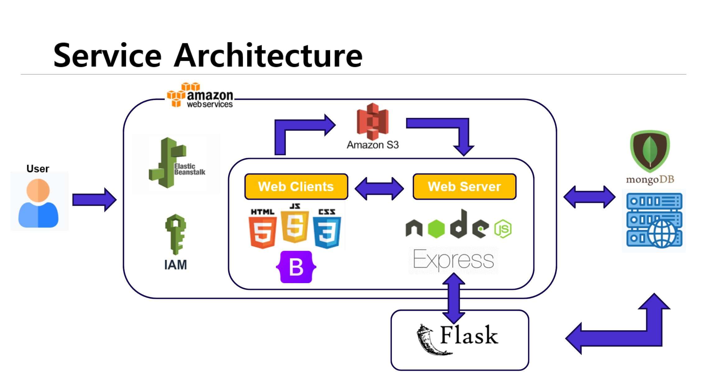

<div align=center>
    
    <h1>Memory Studio</h1>
</div>

  
<p align="center">

    <a href="https://www.youtube.com/watch?v=gP6VshZ0Cgg">
        
    </a>
    <a href="http://memory-studio.ap-northeast-2.elasticbeanstalk.com/">
        
    </a>
    <a href="Appendix/docs.pdf">
        
    </a>
</p>

# 1. About

<!---->
<!---->
<!---->

> memory studio는 크게 두가지 폴더로 구성되어있습니다. face recognition은 ArcFace loss를 이용한 학습과 pretrained model을 불러와서 finetuning하는데 초점을 두었습니다.
>
> service에는 Node.js를 구성하는 finalproject 폴더와 Flask api를 구성하는 deploy_ml 폴더로 되어있습니다.
> 
## 파일 구조
```
Face Recognition
├── Backbone
├── configs
└── docs
  ├── dataset.py
  ├── train.py
  ├── validation.py
  └── inference.py
  └── requirements.txt

Service
└── finalproject
  ├── node_modules
  ├── public
  ├── views
  ├── server.js
  └── package.json
  └── package-lock.json
└── deploy_ml
  ├── app.py
  └── requirements.txt
```

<br/>

## Website
  
<p>
    <a href="http://memory-studio.ap-northeast-2.elasticbeanstalk.com/">
        
    </a>
</p>

## Member

| 김우진 | 신건희 | 신중현 | 이종휘 |
| :----: | :----: | :----: | :----: |
|https://github.com/w-jnn|https://github.com/Rigel0718 |https://github.com/Blackeyes0u0|https://github.com/gndldl|


<!--
|  이름  | github                          |
| :----: | ------------------------------- |
| 김우진 | https://github.com/w-jnn        |
| 신건희 | https://github.com/Rigel0718    |
| 신중현 | https://github.com/Blackeyes0u0 |
| 이종휘 | https://github.com/gndldl       |
-->

<br/>

---

<br/>


# 2. Face Detection & Recognition

Backbone : 사용한 backbone model을 모아놓은 파일입니다.

configs : train.py에 대한 configs 파일입니다.

requirements.txt: 필요한 파이썬 라이브러리를 기술한 파일입니다.

train.py : config 파일과 함께 train 합니다.

<br/>

## 2.1 Pretrained Models & Performance

| Model(Backbone) | dataset | Accuracy | F1-score |
|---|---|---|---|
| Arcface(ResNet-18) | MS1MV3 | 0.5485 | 0.4579 |
| Arcface(MobileNet) | face-emore | 0.5321 | 0.4410 |
| Arcface(ResNet-50)-scratch | Web-face | 0.7812 | 0.7644 |
| Facenet(Inception-ResNet) | VggFace2 | 0.8810 | 0.8262 |
| Facenet(ResNet-50)-scratch | Web-face | 0.7286 | 0.6227 |

<br/>

## 2.2 How to use

- clone

  ```
  git clone https://github.com/deepinsight/insightface.git
  ```
<br/>

## 2.3 Prepare Dataset ( For training)

download the refined dataset: (VGGFace2 recommended)
[VGGFace2 dataset [Visual Geometry Group] ](https://www.robots.ox.ac.uk/~vgg/data/vgg_face2/)
- More Dataset please refer to the Department of Engineering Science, University of Oxford.

<!--
- [emore dataset @ BaiduDrive](https://pan.baidu.com/s/1eXohwNBHbbKXh5KHyItVhQ), [emore dataset @ Dropbox](https://www.dropbox.com/s/wpx6tqjf0y5mf6r/faces_ms1m-refine-v2_112x112.zip?dl=0)
- More Dataset please refer to the [original post](https://github.com/deepinsight/insightface/wiki/Dataset-Zoo)
-->

<br/>

## 2.4 dataset structure

```
- facedataset/
         name1/
             photo1.jpg
             photo2.jpg
             ...
         name2/
             photo1.jpg
             photo2.jpg
             ...
         .....
```
<br/>

## 2.5 Training:

```bash
python train.py configs/config
```
<br/>

---

<br/>

# 3. Service Architecture



> v100서버에 Flask를 RESTful API로 구현하여 모델을 서빙하고 배포했습니다.
>
> AWS Elastic Beanstalk를 사용하여 Node.js를 배포 했고, Flask api와 통신하고 있습니다.
>
> MongoDB Atlas를 사용하여 클라우드 환경의 MongoDB를 연결하였습니다.
>
> v100서버에 Flask를 통해 모델을 서빙하여 배포했습니다.


<br/><br/>


<br/>

---

<br/>

# 4. References

- This repo is mainly inspired by [deepinsight/insightface](https://github.com/deepinsight/insightface) and [FaceNet](https://github.com/davidsandberg/facenet)

